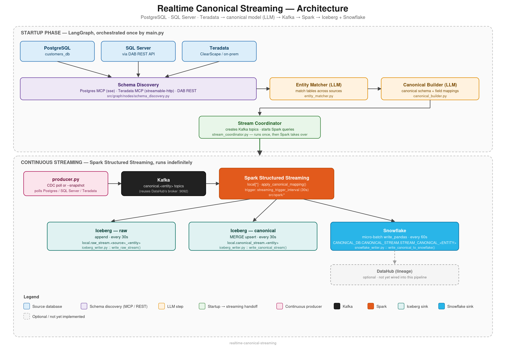

# Realtime Canonical Streaming

A real-time streaming pipeline that discovers schemas across PostgreSQL, SQL Server, and Teradata, uses an LLM to build a unified canonical data model, and continuously streams canonicalized events into Iceberg and Snowflake via Kafka + Spark Structured Streaming.

## Architecture



```
Sources (Postgres / SQL Server / Teradata)
        │  CDC-style polling (producer.py)
        ▼
Kafka (canonical.<entity> topics)
        │
        ▼
Spark Structured Streaming (local[*])
        │
        ├── Kafka → Iceberg raw          (append,  every 30s)
        ├── Kafka → transform → Iceberg canonical  (upsert, every 30s)
        └── Kafka → transform → Snowflake           (append, every 60s)
```

The pipeline runs in two phases:

1. **Startup (LangGraph, `main.py`)** — a one-time graph run:
   `schema_discovery → entity_matcher → canonical_builder → stream_coordinator`
   - **schema_discovery**: pulls table/column metadata from Postgres (MCP), SQL Server (DAB REST API), and Teradata (MCP or direct driver).
   - **entity_matcher**: an LLM matches tables across the three sources that represent the same business entity (e.g. `customer`, `customers`, `CUSTOMER` → canonical `customer`).
   - **canonical_builder**: an LLM generates a unified canonical schema, per-source field mappings, and merge keys for upserts.
   - **stream_coordinator**: creates Kafka topics and starts the Spark Structured Streaming queries. After this, LangGraph steps aside and Spark runs indefinitely.

2. **Continuous streaming (Spark, `producer.py` + `main.py`)** — once the queries are running, `producer.py` polls the sources and publishes row-level events onto the Kafka topics; the streaming queries pick them up and write to Iceberg / Snowflake.

`main.py` and `producer.py` are separate processes: `main.py` sets up the topics and streaming queries (a consumer), `producer.py` is the thing that actually pushes data onto those topics. Both need to be running for data to flow end-to-end.

## Prerequisites

- Python 3.11+
- Java 8/11/17 (required by PySpark)
- Access to a Kafka broker (this project defaults to reusing an existing DataHub Kafka broker on `localhost:9092`)
- PostgreSQL, SQL Server (via a Data API Builder / DAB REST endpoint), and/or Teradata source databases
- An LLM provider: local Ollama, or an Anthropic/OpenAI API key
- A Snowflake account with a role that can create databases/schemas (e.g. `ACCOUNTADMIN`, or a custom role granted `CREATE SCHEMA` on the target database)
- Running MCP servers for Postgres and Teradata schema discovery (URLs configured via `.env`)

## Installation

```bash
git clone <this-repo-url>
cd realtime-canonical-streaming

python3.11 -m venv venv
source venv/bin/activate      # Windows: venv\Scripts\activate

pip install -e .
# For running tests:
pip install -e ".[dev]"
```

PySpark will pull the Kafka/Iceberg/Snowflake connector JARs at runtime via `--packages` (see `src/spark/session.py`), so the first run will download them — make sure the machine has internet access and Maven-compatible connectivity on first launch.

## Setting up the MCP servers

`src/mcp/client.py` connects to two MCP servers for schema discovery (Postgres and Teradata); SQL Server goes through a plain DAB REST call instead (`src/mcp/dab_client.py`), no MCP server needed. Each must be running and reachable at the URL configured in `.env` **before** you start `main.py`.

### Postgres — [crystaldba/postgres-mcp](https://github.com/crystaldba/postgres-mcp) ("Postgres MCP Pro")

Install with Docker (recommended) or `pipx`/`uv`:

```bash
docker pull crystaldba/postgres-mcp
# or: pipx install postgres-mcp
```

Run it with the SSE transport, mapping the container's port to whatever you set `POSTGRES_MCP_URL` to (default in `.env.example` is 8765):

```bash
docker run -p 8765:8000 \
  -e DATABASE_URI=postgresql://postgres@localhost:5432/customers_db \
  crystaldba/postgres-mcp --access-mode=unrestricted --transport=sse
```

This exposes SSE at `http://localhost:8765/sse`, matching `POSTGRES_MCP_URL=http://localhost:8765/sse` in `.env.example`. Use `--access-mode=restricted` instead of `unrestricted` if you want to limit it to read-only queries.

### Teradata — [Teradata/teradata-mcp-server](https://github.com/Teradata/teradata-mcp-server) (official)

Install as a CLI tool:

```bash
uv tool install "teradata-mcp-server"
# or: pipx install "teradata-mcp-server"
```

Set the connection string and start it in **streamable-http** mode (not SSE — see note below):

```bash
export DATABASE_URI="teradata://${TERADATA_USER}:${TERADATA_PASSWORD}@${TERADATA_HOST}:1025/${TERADATA_DATABASE}"
teradata-mcp-server --mcp_transport streamable-http --mcp_port 8767
```

This serves at `http://localhost:8767/mcp/`, matching `TERADATA_MCP_URL=http://localhost:8767/mcp/` in `.env.example`.

> **Transport note:** the Teradata MCP server supports three transports — `stdio` (default), `streamable-http`, and `sse` — each on a different path/protocol. `src/mcp/client.py` in this repo now requests `transport: "streamable_http"` for Teradata to match a URL ending in `/mcp/`. If you instead start the server with `--mcp_transport sse`, update both the URL path (`/sse`) and the transport string in `client.py` to match — a mismatch here doesn't fail cleanly, it hangs the MCP client on connect.

### DataHub — [acryldata/mcp-server-datahub](https://github.com/acryldata/mcp-server-datahub)

Note: `dh_tools` is currently fetched by `main.py` but **not yet wired into `schema_discovery_node`** — this pipeline doesn't use DataHub for discovery today, so this server is optional until that's implemented (see `src/graph/nodes/schema_discovery.py`, which only reads `pg_tools`/`sql_tools`/`td_tools`).

Acryl's officially documented pattern runs `mcp-server-datahub` as a local **stdio** subprocess spawned directly by the MCP client (via `uvx mcp-server-datahub@latest`), authenticated with `DATAHUB_GMS_URL` / `DATAHUB_GMS_TOKEN` env vars — it isn't documented as a standalone SSE server you point a URL at. If you want to wire it in over SSE at `DATAHUB_MCP_URL` (default `http://localhost:5012/sse`) the way Postgres/Teradata are configured here, you'll need to run it behind an HTTP/SSE wrapper yourself (the package is built on [FastMCP](https://github.com/jlowin/fastmcp), which supports an SSE transport mode) — see the [official MCP server docs](https://docs.datahub.com/docs/features/feature-guides/mcp) for the supported stdio setup first.

## Configuration

Copy the example env file and fill in your own values:

```bash
cp .env.example .env
```

`src/config.py` loads everything through `pydantic-settings`. Key settings:

| Section | Variable | Notes |
|---|---|---|
| LLM | `LLM_PROVIDER` | `ollama` (default), `anthropic`, or `openai` |
| LLM | `LLM_MODEL`, `OLLAMA_BASE_URL`, `ANTHROPIC_API_KEY`, `OPENAI_API_KEY` | Only the values for your chosen provider are required |
| Kafka | `KAFKA_BOOTSTRAP_SERVERS`, `KAFKA_TOPIC_PREFIX` | Topics are created as `<prefix>.<entity>`, e.g. `canonical.customer` |
| Spark | `SPARK_MASTER`, `SPARK_DRIVER_MEMORY`, `SPARK_EXECUTOR_MEMORY` | Defaults to `local[*]` |
| Iceberg | `ICEBERG_WAREHOUSE`, `ICEBERG_RAW_NAMESPACE`, `ICEBERG_CANONICAL_NAMESPACE`, `ICEBERG_CHECKPOINT_DIR` | Local filesystem warehouse by default |
| MCP | `POSTGRES_MCP_URL`, `TERADATA_MCP_URL`, `DATAHUB_MCP_URL` | Must match the transport your MCP servers actually expose (see **Troubleshooting**) |
| Postgres | `POSTGRES_CONNECTION_STRING`, `POSTGRES_SCHEMA` | |
| SQL Server | `DAB_BASE_URL`, `DAB_ENTITIES` | Schema is inferred from sample rows returned by the DAB REST API |
| Teradata | `TERADATA_HOST`, `TERADATA_USER`, `TERADATA_PASSWORD`, `TERADATA_DATABASE`, `TERADATA_ENABLED` | |
| Snowflake | `SNOWFLAKE_ACCOUNT`, `SNOWFLAKE_USER`, `SNOWFLAKE_PASSWORD`, `SNOWFLAKE_WAREHOUSE`, `SNOWFLAKE_DATABASE`, `SNOWFLAKE_SCHEMA`, `SNOWFLAKE_ROLE` | Leave `SNOWFLAKE_ACCOUNT` empty to disable the Snowflake sink entirely |
| Pipeline | `ENTITIES` | Canonical entity names the pipeline manages, e.g. `["customer","order","product"]` |

**Never commit `.env`** — it's expected to hold live credentials. Only `.env.example` (with placeholder values) should be checked in. Add a `.gitignore` entry for `.env` before your first commit (see below).

## Running the pipeline

Start the streaming pipeline (schema discovery → canonical model → Kafka topics → Spark streaming queries):

```bash
python main.py                # start streaming, wait for producer.py to feed data
python main.py --snapshot     # also publish all existing source rows once at startup
python main.py --status       # show status of currently active streaming queries
```

In a separate terminal, run the producer to actually publish data onto the Kafka topics — `main.py` alone only sets up the plumbing and won't create any Snowflake/Iceberg tables until rows are flowing:

```bash
python producer.py                    # continuous CDC-style polling of all sources
python producer.py --snapshot         # one-time backfill of all existing rows, then exit
python producer.py --entity customer  # limit to a single entity
```

Stop either process with `Ctrl+C` — both register signal handlers for a graceful shutdown (`stop_all_queries()` in `main.py`, `producer.close()` in `producer.py`).

## Verifying data landed

- **Iceberg**: query the local warehouse at `ICEBERG_WAREHOUSE` (raw tables under `local.<raw_namespace>.<source>_<entity>`, canonical tables under `local.<canonical_namespace>.<entity>`).
- **Snowflake**: tables are created as `<SNOWFLAKE_DATABASE>.<SNOWFLAKE_SCHEMA>.STREAM_CANONICAL_<ENTITY>` (e.g. `CANONICAL_DB.CANONICAL_STREAM.STREAM_CANONICAL_CUSTOMER`). A minimal check script:

```python
import snowflake.connector
from src.config import settings

with snowflake.connector.connect(**settings.snowflake_conn_params) as conn:
    cur = conn.cursor()
    cur.execute(f"SHOW TABLES IN SCHEMA {settings.snowflake_database}.{settings.snowflake_schema}")
    for row in cur.fetchall():
        print(row[1])
```

## Troubleshooting

- **No Snowflake schema/table ever appears, no errors logged**: check that `SNOWFLAKE_ACCOUNT` is actually set in `.env` — the Snowflake sink in `stream_coordinator_node` is silently skipped (`if settings.snowflake_account: ...`) when it's empty.
- **"schema not created yet" errors**: `src/spark/snowflake_writer.py::_ensure_schema_exists()` creates the database/schema once per process before starting the write stream. If you change `SNOWFLAKE_SCHEMA` in `.env`, you must fully restart `main.py` — `pydantic-settings` reads `.env` once at process start, and the module-level `_schema_ensured` flag won't re-run for an already-running process.
- **Table never appears even though the schema exists**: the table itself is only created on the first non-empty micro-batch (`write_pandas(..., auto_create_table=True)`); it needs actual rows flowing through Kafka. Make sure `producer.py` is running (or run `main.py --snapshot` / `producer.py --snapshot` for a one-time backfill).
- **MCP connection hangs on startup**: check that the transport in `src/mcp/client.py` matches how each MCP server was actually started (see **Setting up the MCP servers** above) — `stdio`/`sse`/`streamable-http` are not interchangeable, and a mismatch hangs the client on connect instead of failing fast. A URL ending in `/mcp/` is a strong hint the server is running `streamable-http`, not `sse`.
- **Teradata discovery via direct driver fails with `ModuleNotFoundError: src.teradata.client`**: the fallback path in `schema_discovery.py` (used when no Teradata MCP tools are available but `TERADATA_HOST` is set) references `src/teradata/client.py`, which doesn't exist in this repo yet. Either implement it, or make sure your Teradata MCP server is reachable so the MCP path is used instead.

## Project layout

```
main.py                        Streaming pipeline entrypoint (LangGraph startup + Spark handoff)
producer.py                    Standalone CDC producer (polls sources, publishes to Kafka)
src/
  config.py                    Centralized settings (pydantic-settings, loads .env)
  graph/
    state.py                   LangGraph state schema
    supervisor.py               Builds the LangGraph startup graph
    nodes/
      schema_discovery.py       Postgres / SQL Server / Teradata schema discovery
      entity_matcher.py         LLM-based cross-source entity matching
      canonical_builder.py      LLM-generated canonical schema + field mappings
      stream_coordinator.py     Creates Kafka topics, starts Spark streaming queries
  kafka/
    topics.py                   Kafka topic create/list/delete
    producer.py                 KafkaEventProducer (CDC polling + snapshot publishing)
    schemas.py                  Kafka event schemas
  spark/
    session.py                  SparkSession factory (Kafka/Iceberg/Snowflake packages)
    kafka_reader.py              Kafka → Spark streaming DataFrame
    transformer.py               Applies canonical field mappings to raw events
    iceberg_writer.py             Raw (append) + canonical (MERGE upsert) Iceberg writers
    snowflake_writer.py           Micro-batch Snowflake writer (write_pandas)
  mcp/
    client.py                    MCP client for Postgres/Teradata/DataHub tool discovery
    dab_client.py                 SQL Server schema discovery via DAB REST API
tests/
```

## Recommended `.gitignore` additions

```
.env
__pycache__/
*.pyc
.venv/
venv/
/tmp/streaming_iceberg_warehouse/
/tmp/streaming_checkpoints/
.pytest_cache/
```
